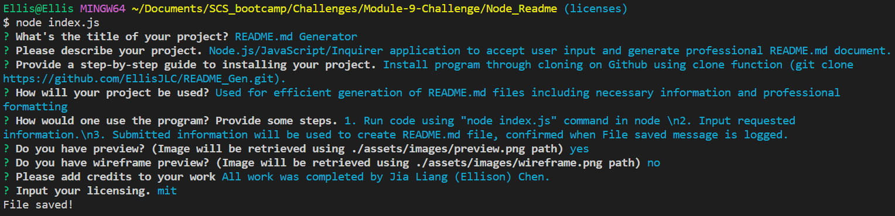

# README.md Generator

## Introduction

Node.js/JavaScript/Inquirer application to accept user input and generate professional README.md document.

## Table of Contents 
1. [Installation](#installation)
2. [Usage](#usage)
3. [Test](#test)
4. [Images](#images)
5. [Credits](#credits)
6. [Licenses](#licenses)

## Installation 

Install program through cloning on Github using clone function (git clone https://github.com/EllisJLC/README_Gen.git).

## Usage

Used for efficient generation of README.md files including necessary information and professional formatting

## Test

1. Run code using "node index.js" command in node.
2. Input requested information.
3. Submitted information will be used to create README.md file, confirmed when File saved message is logged.

## Images

Image of console

## Credits

All work was completed by Jia Liang (Ellison) Chen.

## Licenses 

The MIT License: https://opensource.org/licenses/MIT